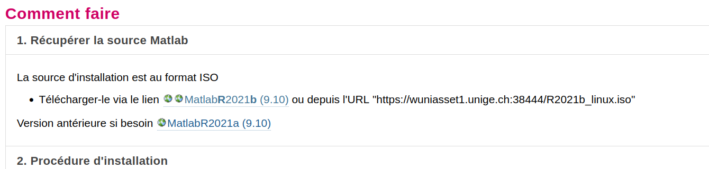
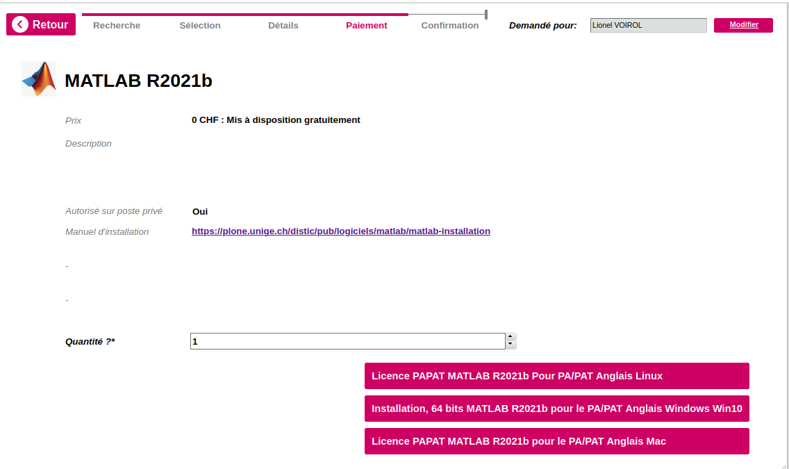
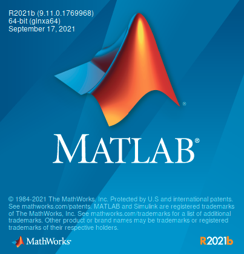
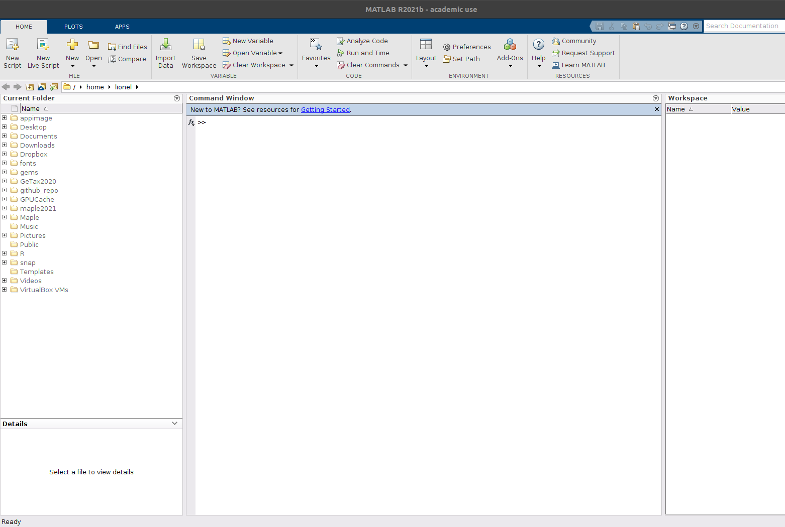

# Matlab installation with a UNIGE account

## Introduction:
The detailed procedure for installing Matlab with a UNIGE license (found [here](https://plone.unige.ch/distic/pub/logiciels/matlab/comment-installer-matlab-sur-linux)) lacks some details that lead to a laborious installation. This repo provides a step-by-step installation procedure.

## :round_pushpin:Notes and disclaimers 
- We assume the user has the ability to request a Matlab licence at the University of Geneva.
- We assume the user has a Ubuntu Linux 20.04 installation.
- We assume the user aims to install Matlab 2021b.

## Downloading the `.iso` file, the licence number, the `installer_input_unige.txt` and the `matlablm_unige.dat` files:
- Download the `.iso` file [here](https://plone.unige.ch/distic/pub/logiciels/matlab/comment-installer-matlab-sur-linux).

<p align="center">

</p>


- Request a licence number and download the `installer_input_unige.txt` and the `matlablm_unige.dat` [here](https://logiciels.unige.ch/). 

:warning: **Make sure to save the licence key provided at this step!**

<p align="center">

</p>


## Mount the `.iso` file and copy paste content to another directory:
- Mount the `.iso` file.
- Copy the content to a new file using `rsync`. 

##
Modify the `installer_input_unige.txt`:
- Change the `destinationFolder` from `destinationFolder=/usr/local/R2021a` to
```bash
destinationFolder=/usr/local/MATLAB/R2021b
```
- Specify the correct licence number in the `installer_input_unige.txt` file to:
```bash
fileInstallationKey= your_licence_number
```
- Change the `outputFile` to:
```bash
outputFile=/tmp/mathworks_R2021b.log
```
- Specify the correct `licencePath`:
```bash
licensePath=./matlablm_unige.dat
```
- Comment out all unecessary toolboxes with `#`.

## Run the installation and check installation `log` file:
```bash
 sudo ./install -inputfile ./installer_input_unige.txt
```
Check that the file was indeed well installed with:
```bash
vim /tmp/mathworks_R2021b.log 
```

You should see something like:

```bash
(Mar 02, 2022 12:16:29) 89%
(Mar 02, 2022 12:16:30) 90%
(Mar 02, 2022 12:16:31) 91%
(Mar 02, 2022 12:16:32) 92%
(Mar 02, 2022 12:16:33) 93%
(Mar 02, 2022 12:16:34) 94%
(Mar 02, 2022 12:16:35) 95%
(Mar 02, 2022 12:16:37) 97%
(Mar 02, 2022 12:16:37) 98%
(Mar 02, 2022 12:16:38) 99%
(Mar 02, 2022 12:16:39) 100%
(Mar 02, 2022 12:16:39) Generating Java class path for /usr/local/MATLAB/R2021b
(Mar 02, 2022 12:16:39) Successfully generated Java class path for /usr/local/MATLAB/R2021b
(Mar 02, 2022 12:16:39) Generating pathdef.m for /usr/local/MATLAB/R2021b
(Mar 02, 2022 12:16:39) Successfully generated pathdef.m for /usr/local/MATLAB/R2021b
(Mar 02, 2022 12:16:39) Exiting with status 0
(Mar 02, 2022 12:16:39) End - Successful

```

## Create an alias to launch Matlab:
in your `.bashrc` or `.zshrc`, add the following alias:

```bash
alias matlab="/usr/local/MATLAB/R2021b/bin/matlab"
```

## Launch Matlab:
Launch Matlab with:
```bash
matlab
```

You should see something like:

<p align="center">

</p>

and then, you should have access to the Matlab editor:

<p align="center">

</p>

## A note on the VPN
Outside of the Unige network, the user should use use a VPN in order to use Matlab. The procedure is explained [here](https://plone.unige.ch/distic/pub/logiciels/forticlient/comment-installer-forticlient-linux) and is straighforward.

## Useful commands:
- `xhost +SI:localuser:root` enables modification of the folder
- `rsync -av old_folder new_folder` provides fast incremental file transfer 


Well done! :nerd_face: :sunglasses:

